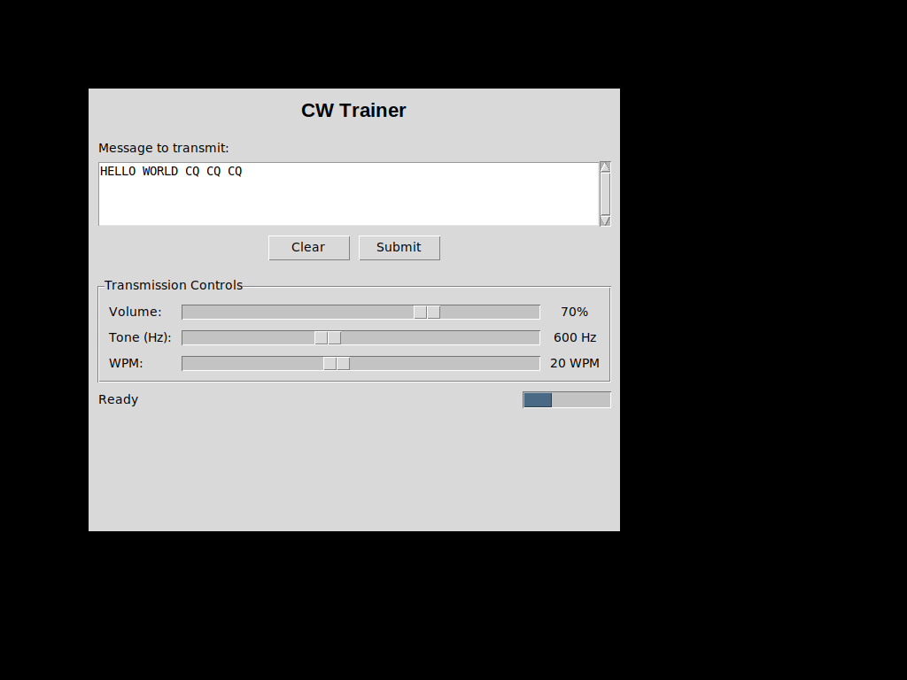

# CW Trainer GUI

A TKinter-based graphical user interface for the CW Trainer morse code practice tool.

## Features

The GUI provides a complete interface for morse code practice with the following components:

### Input Controls
- **Text Input Area**: Large scrollable text box for entering messages to transmit
- **Clear Button**: Clears the text input area
- **Submit Button**: Starts transmission of the entered message

### Transmission Controls
- **Volume Control**: Slider to adjust audio volume (0-100%)
- **Tone Control**: Slider to adjust tone frequency (400-900 Hz, default: 600 Hz)
- **WPM Control**: Slider to adjust transmission speed (5-40 WPM, default: 20 WPM)

### Status Information
- **Status Display**: Shows current transmission status and morse code conversion
- **Progress Indicator**: Visual progress bar during transmission

## Usage

### Launching the GUI

```bash
# Direct launch
python3 cw_trainer_gui.py

# Or via main launcher (default mode)
python3 main.py
python3 main.py --gui
```

### Using the Interface

1. **Enter Message**: Type your message in the large text input area
2. **Adjust Settings**: Use the sliders to set your preferred:
   - Volume level
   - Tone frequency (higher frequencies are easier to hear for some people)
   - Transmission speed in Words Per Minute (WPM)
3. **Transmit**: Click the "Submit" button to start transmission
4. **Clear**: Use the "Clear" button to empty the text input area

### Supported Characters

The GUI supports all standard morse code characters:
- Letters: A-Z
- Numbers: 0-9
- Punctuation: . , ? ' ! / ( ) & : ; = + - _ " $ @
- Spaces: Automatic word spacing

### Audio System

The GUI includes both real and mock audio implementations:
- **Real Audio**: Uses numpy and simpleaudio for actual tone generation
- **Mock Audio**: Falls back to timing-only simulation when audio libraries aren't available

## Dependencies

### Required
- Python 3.6+
- tkinter (usually included with Python)

### Optional (for actual audio)
- numpy >= 1.20.0
- simpleaudio >= 1.0.4

### Installing Dependencies

```bash
# Install audio dependencies
pip install -r requirements.txt

# On Ubuntu/Debian, you may also need:
sudo apt-get install python3-tk libasound2-dev
```

## File Structure

- `cw_trainer_gui.py` - Main GUI implementation
- `main.py` - Launcher with CLI/GUI options
- `morse_code.py` - Core morse code logic
- `test_gui.py` - Test suite for GUI functionality
- `requirements.txt` - Python dependencies

## Testing

Run the test suite to verify functionality:

```bash
python3 test_gui.py
```

This will test:
- Morse code conversion accuracy
- GUI component creation
- Default value settings
- Timing calculations

## Screenshot



The interface shows all the required controls in an intuitive layout with real-time feedback.